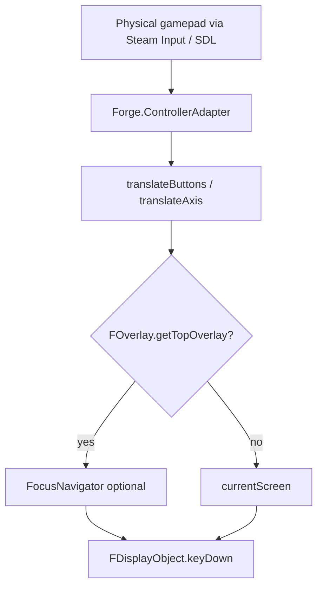

# Controller Support — Design Spec

**Date:** 2026-07-02  
**Parent brief:** [2026-07-02-controller-support-cursor-brief.md](./2026-07-02-controller-support-cursor-brief.md)  
**Module:** `forge-gui-mobile` (+ `forge-gui-mobile-dev` launcher only if needed)

---

## 1. Summary

Enable full gamepad play on the libGDX client (Steam Deck native desktop path) by:

1. Turning on the existing controller→key-code pipeline for classic mode (Workstream 0).
2. Introducing a shared **focus navigation layer** for menus and compound widgets.
3. Closing in-match interaction gaps via thin mobile UI adapters.
4. Adding glyphs, focus rings, and Steam Deck launch documentation.

Adventure mode keeps its separate `Scene.SceneControllerListener` path. Classic mode uses `Forge.enableControllerListener()` → `Keys.*` dispatch. **Do not merge the two systems.**

---

## 2. Input architecture



### 2.1 Controller pipeline (existing, extended)

| Layer | Responsibility |
|---|---|
| `ControllerAdapter` | Connect/disconnect, set `controllerInputActive`, `lastInputWasController` |
| `translateButtons` | Face buttons, d-pad, shoulders, Back → libGDX `Keys` |
| `translateAxis` | L2/R2 → Enter/Escape; left-stick Y → PAGE_DOWN (WS2 expands scope) |
| Dispatch | `FOverlay.getTopOverlay()` else `currentScreen` → `container.keyDown()` |

**Naming (WS0):**

| Symbol | Meaning |
|---|---|
| `controllerInputActive` (private field) | Pad is the active input modality; cleared on mouse move, set on pad events |
| `hasGamepad()` (public method) | Feature gate: `controllerInputActive && isLandscapeMode()` |
| `lastInputWasController()` | Last meaningful input came from a pad |

### 2.2 Dual-listener safety

`enableControllerListener()` must register with `Controllers` **at most once**. Adventure's `openAdventure()` also calls it; idempotent registration prevents double dispatch.

---

## 3. Focus navigation layer (WS1)

New types in `forge-gui-mobile/src/forge/toolbox/focus/`:

### 3.1 `Focusable` interface

```java
public interface Focusable {
    /** Screen-space bounds for geometry navigation. */
    Rectangle getFocusBounds();
    boolean isFocusable();
    void onFocusGained();
    void onFocusLost();
    /** A / Enter confirms this element. Return true if consumed. */
    boolean onFocusActivate();
}
```

Optional default: `onFocusActivate()` delegates to `keyDown(Keys.BUTTON_A)`.

### 3.2 `FocusNavigator`

Owns an ordered list of `Focusable` entries (or derives them from an `FContainer`).

| Method | Behavior |
|---|---|
| `move(Direction)` | Geometry-aware nearest neighbor in direction |
| `activate()` | Call `onFocusActivate()` on current |
| `cancel()` | Delegate B/Escape to parent screen |
| `refreshFocusables()` | Re-scan after layout / dynamic children change |
| `scrollIntoView()` | Scroll ancestor `FScrollPane` / list so focused bounds are visible |

### 3.3 Geometry rules (first pass)

1. **Neighbor selection:** From current focus center, find enabled focusables whose center lies in the requested quadrant (up/down/left/right). Pick minimum Euclidean distance. Tie-break: primary-axis distance, then stable child order.
2. **No neighbor:** **Stay put** (no wrap).
3. **Scroll panes:** Focusables outside the clip rect remain reachable; on focus change, call `scrollIntoView()` on the nearest scroll parent (pattern from `VDisplayArea`).
4. **Dynamic layouts:** `LobbyScreen` / `ILobbyView` updates call `refreshFocusables()`; restore focus by identity if possible, else first focusable.

### 3.4 `FocusGroup` mixin / container

`FocusGroup extends FContainer implements Focusable` (or composition):

- Designated **focus owner** — `keyDown` on the group intercepts d-pad / A / B before broadcasting to all children.
- Integrates with `FContainer` broadcast: focus owner handles nav keys first; unhandled keys fall through to existing child broadcast.
- Draws a **focus ring** in `draw()` around the current `Focusable` (distinct from `setHovered(true)`).

### 3.5 Popup / overlay scope

When `FOverlay.getTopOverlay() != null`, focus is scoped to that overlay:

- Trap d-pad and A/B inside the overlay until dismissed.
- On `hide()`, restore focus to the underlying screen's last selection.
- Applies to `FOptionPane`, `FPopupMenu` (`NewGameMenu`), `FDeckChooser`, context menus.

`FScreen` and `FOverlay` subclasses opt in by hosting a `FocusNavigator` or extending `FocusGroup`.

### 3.6 Compound widget semantics (WS4)

| Widget | D-pad | A (confirm) | B |
|---|---|---|---|
| `FButton` | Focus target | `trigger()` | — |
| `FCheckBox` | Focus target | Toggle checked | — |
| `FComboBox` | Focus target | Open dropdown; when open, d-pad cycles values | Close without change |
| `FScrollPane` | Focus enters child list | — | — |
| `FMenuTab` / `FDropDown` | Existing tab + list nav (keep behavior) | — | — |

### 3.7 `FButton` change (WS1)

Add `Keys.BUTTON_A` to `FButton.keyDown()` alongside ENTER/SPACE. Press animation hook in `trigger()` already exists.

---

## 4. Text input (WS5 + WS6)

**Primary path (Steam Deck):** `Forge.setOnScreenKeyboard(true, numeric)` → `Gdx.input.setOnscreenKeyboardVisible()`. On SteamOS Game Mode this should surface the system keyboard when a text field is focused and A is pressed.

**Fallback:** If OSK does not appear on Deck during testing, use Adventure's `KeyBoardDialog` for classic-mode text fields (deck rename, search, settings).

**v1 skip:** If both paths fail on Deck, deck save uses default/generated name and search is disabled by pad (touch still works).

Implementation: small `ClassicTextInput` helper in `forge/toolbox` wrapping the try-OSK-then-fallback logic, invoked from deck editor and settings focus handlers.

---

## 5. Screen adoption map

| WS | Screens / components | Notes |
|---|---|---|
| 0 | `Forge.java` | Classic listener + `hasGamepad()` gate |
| 1 | `FocusNavigator`, `FButton`, `LaunchScreen` | Foundation |
| 2 | `Forge.java` translateAxis/buttons | Triggers + stick outside MatchScreen |
| 3 | `HomeScreen`, `NewGameMenu` | Popup focus for `FPopupMenu` |
| 4 | `LobbyScreen`, `ConstructedScreen`, `PlayerPanel`, `FDeckChooser`, compound widgets | Dynamic lobby refresh |
| 5 | `FDeckEditor` | Largest screen; catalog ↔ deck pane focus |
| 6 | `SettingsScreen`, `SettingsPage`, `TabPageScreen` | Reuse WS4 widgets |
| 7 | `FOptionPane` | D-pad between option buttons; A confirms focused |
| 8 | `VAvatar`, `MatchScreen`, mobile match views | Attack/block/targets/mana; menu-bar ENTER guard |
| 9 | Glyphs, focus ring polish, `docs/Steam-Deck-and-Bazzite-Install.md` | |
| 10 | `VField`, `ItemManager` | Opportunistic refactor only |

**v1 menu scope (confirmed):** Home → NewGameMenu → Constructed → Lobby → Deck editor → Match. Other home entries (Draft, Sealed, Adventure, etc.) remain touch-only for v1.

---

## 6. In-match gaps (WS8)

| Gap | Mobile UI | Game contract |
|---|---|---|
| Attack target selection | D-pad between `VAvatar` panels, A confirms | `InputAttack` / `onPlayerSelected` |
| Blocker attacker switch | D-pad + A on avatar strip | `InputBlock` |
| Multi-target cycling | D-pad cycles candidates, A toggles/selects | `InputSelectTargets` |
| Mana payment | Selectable mana-source list or field-nav extension | `InputPayMana` |

Pattern: thin adapter in `screens/match/*` calling existing `MatchController` APIs (same as `VAvatar` today).

**Menu-bar guard fix:** `MatchScreen.keyDown` (~525) drops ENTER/ESCAPE when menu bar is open and `hasGamepad()`. Narrow the guard so dialog OK/Cancel still works when a confirm dialog is showing.

---

## 7. Visual feedback (WS9)

- **Focus ring:** 2px accent border drawn by `FocusGroup` / `FocusNavigator` around focused bounds.
- **Hover:** Keep `setHovered(true)` for compatibility with match UI.
- **Glyphs:** Generalize `KeyBinding.getLabelText()` beyond hardcoded `"XBox_"` prefix; use Xbox-style A/B/X/Y (Steam Input normalizes pads).

---

## 8. Manual test matrix

See [2026-07-02-controller-support.md](../plans/2026-07-02-controller-support.md#manual-test-matrix). Update after each workstream.

**Regression:** Adventure world + battle smoke test after every increment.

---

## 9. Acceptance test

Boot → Home → Constructed → build deck (add/remove/save) → configure lobby → start duel → full turn (attack chosen opponent, declare blockers, multi-target spell, pay mana) → concede — **entirely by controller**, no touch. No regression to touch or Adventure pad nav. Both Stadia BT and Switch Pro via Steam Input.

---

## 10. Non-goals

Unchanged from parent brief: Swing client, per-pad SDL mappings, portrait pad, rewriting `forge-gui` input contracts, online flows beyond acceptance path.
